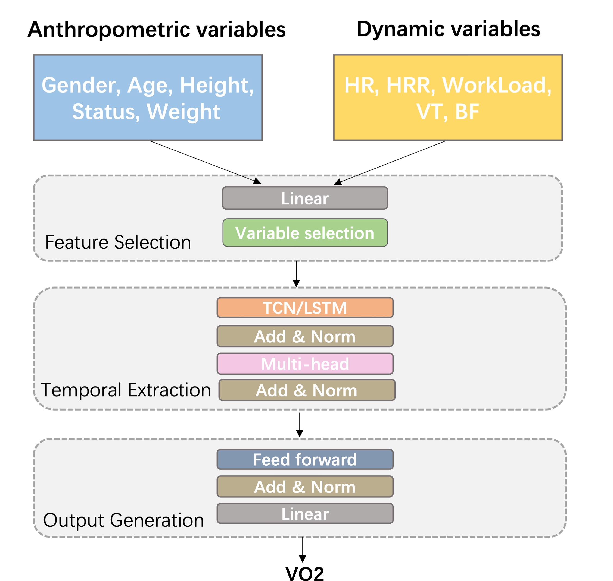

## Overview

    

This repository contains the code and resources related to our paper titled **"Oxygen Uptake Estimation During Cardiopulmonary Exercise Testing Using Temporal Fusion Networks."** 

Oxygen uptake dynamics ($\dot{\mathrm{V}}\mathrm{O}_2$) during cardiopulmonary exercise testing (CPET) is a standard metric for evaluating the efficiency of the cardiovascular, respiratory, and skeletal muscle systems in transporting and utilizing oxygen in response to varying exercise intensities. Maximal oxygen consumption ($\dot{\mathrm{V}}\mathrm{O}_2 \max$), derived from instantaneous $\dot{\mathrm{V}}\mathrm{O}_2$ measurements, represents the maximum oxygen uptake an individual can achieve during incremental CPET. This metric serves as a quantitative benchmark of an athlete's or patient's aerobic fitness and is crucial for developing tailored training or rehabilitation plans.

Instantaneous $\dot{\mathrm{V}}\mathrm{O}_2$ measurements also play a vital role in estimating energy expenditure (EE), which enhances nutritional management for elderly patients frequently admitted to intensive care units. Additionally, these measurements serve as biomarkers in medical research, allowing for the monitoring of disease progression and status in chronic cardiovascular and respiratory conditions.
